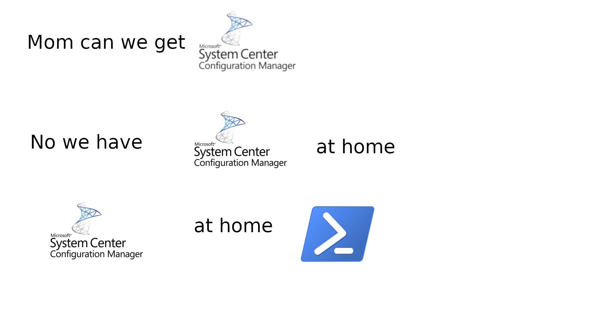

# Mom's SCCM

## Start

To start things off let's explain why I wrote this script. At my current position I needed a temporary but quick way to configure a Windows workstation. Going through the Windows setup was painful, and then 35 minutes later you have to start clicking buttons and checking boxes. So I wrote this to slap a big ol bandaid on everything.

## Use Case

Don't use this script. If anything it's just a fun little project that was used to experiment with PoSH. Any organization specific information had to be removed so I can't stress this enough, but, this script WILL NOT work if you try running it. Please just use it as an example.

## Why is it called Mom's SCCM

Well, basically, SCCM would be really nice to help with what this script does...but...we don't have it.

Here is my rational thinking behind it:

## Part 1 (Media Creation Tool)

The whole process of configuring a Windows system starts with imaging. I personally use the Media Creation Tool alongside an answer file to get through the entire setup from partitioning to OOBE.

## Part 2 (deploy.ps1)

All the files you see in this repo are contained within a directory in the root of the media creation USB.

I created two batch scripts that call the PoSH function with the appropriate switches. The reason for batch scripts is because of the execution policy being set to restricted by default on a Windows system and with the correct `powershell.exe` command, you can have the world!

## Final Notes

I honestly don't feel like explaining this script because it is very specific to my needs. Use this as learning material and USE GPOs =)

## What You Can Learn From This

- `ParameterSetName`
- `[ValidateNotNullOrEmpty()]`
- `Write-LogEntry` - Custom logging function
- `Start-Process` - to install .exe and .msi
- An example of a custom function to install specific applications - see `Install-CJ` function
- Adding entries to the start menu and public desktop
- Modifying the registry to remove annoying stuff
- Calling functions in a weird, but new way
- `New-PSDrive`
- `Remove-PSDrive`
- A .NET based menu to choose what to install (it's weird...but interesting)
- `Add-Computer`
- `Get-AppxPackage`
- `Get-AppxProvisionedPackage`
- `Remove-AppxPackage`
- `Remove-AppxProvisionedPackage`
- `Get-NetAdapterBinding`
- `Disable-NetAdapterBinding`
- `powercfg`
- `Set-TimeZone`
- `Import-StartLayout`
- `Dism.exe`
- `cscript`
- and probably a bunch of stuff I forgot to include